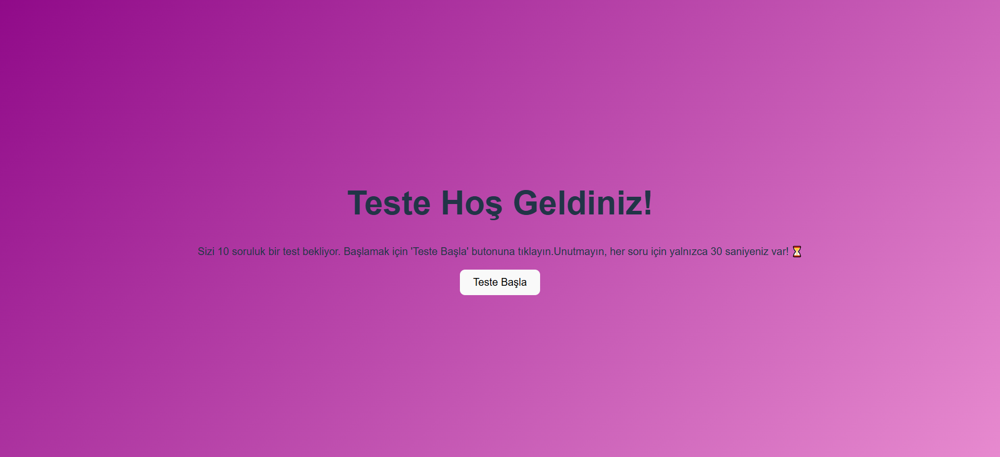
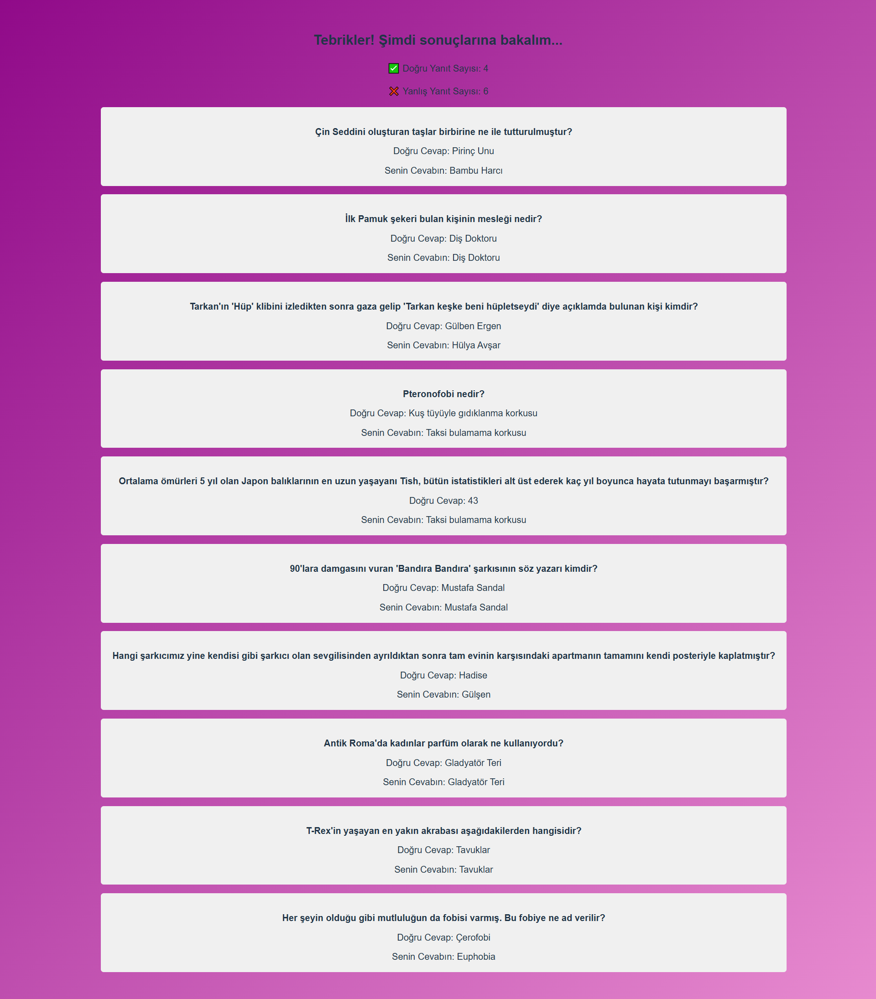

# Question App 🚀

This project is a test application titled Question App. Users can answer various questions and learn about their correct and incorrect answers.

## Features 🌟

- Questions and options
- User answers and results
- Time-limited test
- Modern user interface

## Live Demo 🌐

You can try the live version of the application [here]([https://your-live-link.vercel.app](https://question-app-react-seven.vercel.app/)).

## Installation 🛠️

To run the project on your local machine, follow these steps:

1. **Clone the repository:**

   ```bash
   git clone https://github.com/elfdrkn/QuestionApp-React

2. **Navigate to the project directory:**

    cd project-name

3. **Install the necessary dependencies:**

    npm install

4. **Start the development server:**

    npm start

## Usage 📝

    Start the application.
    Answer the questions.
    View your correct and incorrect answers at the end of the test.

## Screenshots  
  


